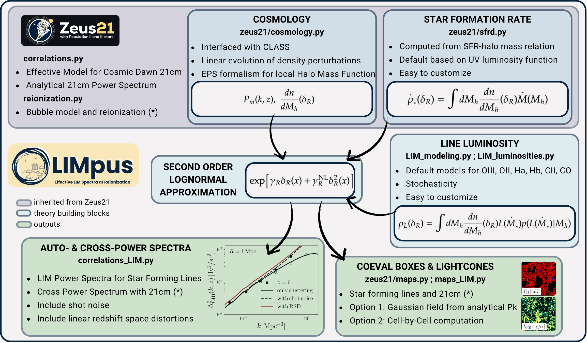

<p align="center">
  
</p>

# oLIMpus: An Effective Model for Line Intensity Mapping Auto- and Cross-Power Spectra in the Epoch of Reionization

---

**oLIMpus** is an actively maintained and expanding Python-based framework for simulating line intensity mapping (LIM) signals during the epoch of reionization (EoR). It provides a fast and efficient way to compute **non-linear power spectra** of star-forming lines, and generates both **coeval boxes** and **lightcones**.

The 21cm signal is introduced by interfacing oLIMpus with [`Zeus21`](https://github.com/JulianBMunoz/Zeus21), a public code for 21cm signal modeling at cosmic dawn. A version of `Zeus21` is included in this repository as a submodule. Note that the original `Zeus21` currently models only the power spectrum during cosmic dawn; support for the reionization era is under active development.

---

<p align="center">
  
</p>

---

## ⚙️ Installation

We recommend creating a new virtual environment based on **python 3.10** when installing the code, to avoid dependency conflicts. Using **anaconda**, this can be done through
```bash
  conda create --name oLIMpus python=3.10

  conda activate oLIMpus
```

To install **oLIMpus**, first install **cython**:
```bash
pip install cython
```
then, in the folder where you downloaded the repository, run:
```bash
pip install .
```

⚠️ Note:
oLIMpus includes its own version of zeus21 as a submodule, last updated in May 2025; later versions of zeus21 may introduce changes that are not compatible with this code. If, for some reason, you want to run oLIMpus with a different zeus21 version, contact us to verify differences between various versions.

The authors are committed to keep the two codes updated and compatible once new milestones are reached on one side or the other. 

---

## 🔧 Included Modules

- **`inputs_LIM.py`**  
  Set the input parameters to compute the line luminosity and to set the properties of the power spectrum (e.g., linear/quadratic lognormal, with/without shot noise, with/without RSD).

- **`LIM_luminosities.py`**  
  Default models for the line luminoisty-SFR or -halo mass relations. Default includes models for OIII, OII, Ha, Hb, CII, CO21.

- **`LIM_modeling.py`**  
  Compute the quantities needed to setup the model (e.g., the line luminosity density and the coefficients of the lognormal).

- **`correlations_LIM.py`**  
  Computes auto- and cross-power spectra of various emission lines, including astrophysical nonlinearities, redshift-space distortions, shot noise.

- **`analysis.py`**  
  Fiducial setup, create a collective class to run oLIMpus and Zeus21 and get consistent outputs.

- **`maps_LIM.py`**  
  Functions required to produce coeval maps and lightcones.

- **`zeus21_local/zeus21/`** (submodule)  
  Modified version of [`zeus21`](https://github.com/zeus21/zeus21) used to compute 21cm power spectra and fields during cosmic dawn (reionization modeling in progress). For details, see Zeus21 official documentation. 

---

## 📚 Tutorials

The following notebooks and scripts will help you get started:

- **`oLIMpus.ipynb`** – Compute and visualize the LIM and 21-cm auto- and cross-power spectra  
- **`explore_parameters.ipynb`** – Explore how the LIM power spectrum depends on different parameters   
- **`boxes_and_lightcones.ipynb`** – Create coeval boxes and lightcones 

> 📌 You can find all tutorials in the `Tutorials/` folder.

---

## 📄 Relevant Publications

- Libanore, Mu&ntilde;oz and Kovetz, *oLIMpus: An Effective Model for Line Intensity Mapping Auto- and Cross-Power Spectra in the Epoch of Reionization*, [arXiv:2506.YYYYY](https://arxiv.org/abs/2506.YYYYY)

- Mu&ntilde;oz, *An Effective Model for the Cosmic-Dawn 21-cm Signal*, [arXiv:2302.08506](https://arxiv.org/abs/2302.08506)

- Sklanksy et al., *In preparation*

- Cruz, Mu&ntilde;oz, Sabti and Kamionkowski, *The First Billion Years in Seconds: An Effective Model for the 21-cm Signal with Population III Stars*, [arXiv:2407.18294](https://arxiv.org/abs/2407.18294)

---

## 📬 Contact

For questions, suggestions, or help using the code, please contact:

**Sarah Libanore**  
📧 [libanore@bgu.ac.il](mailto:libanore@bgu.ac.il)  

---

> ⭐ If you use **oLIMpus** in your work, please cite the relevant papers!
